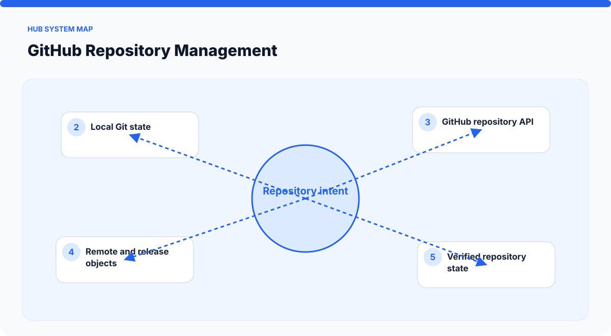
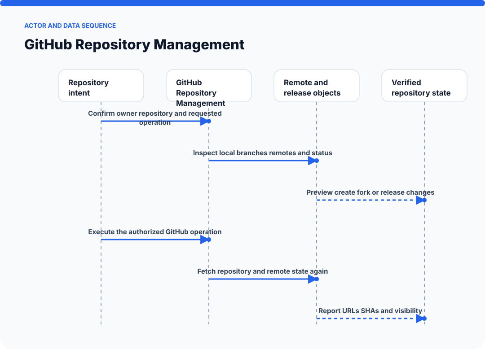
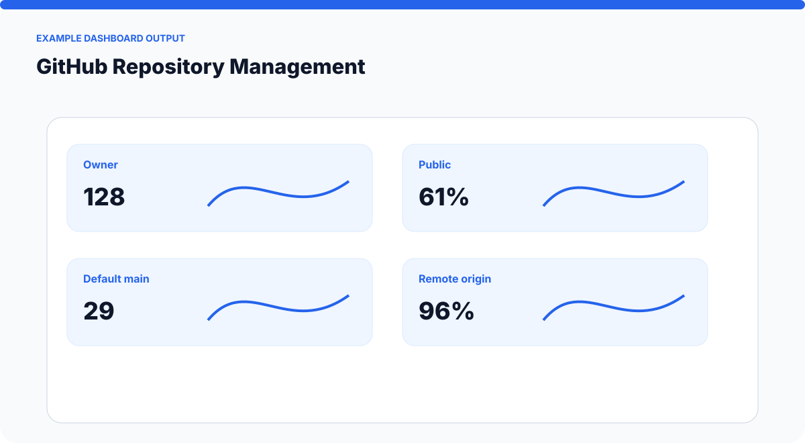
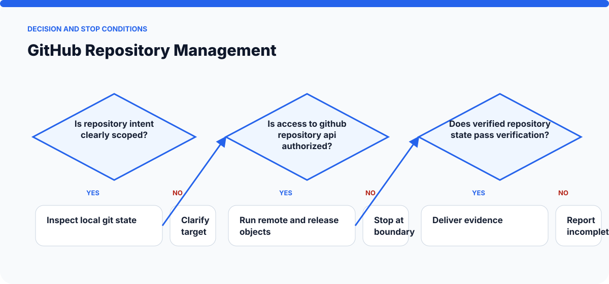

# How GitHub Repository Management Works

The visuals on this page are static SVGs, so they render directly on GitHub on phones and desktop browsers. Each one is generated from a model specific to this skill.

## System architecture

### Components

- **1. Repository intent:** participates in confirm owner repository and requested operation.
- **2. Local Git state:** participates in inspect local branches remotes and status.
- **3. GitHub repository API:** participates in preview create fork or release changes.
- **4. Remote and release objects:** participates in execute the authorized github operation.
- **5. Verified repository state:** participates in fetch repository and remote state again.

## Actor and data sequence

### 1. Confirm owner repository and requested operation

**Primary surface:** `Repository intent`

Record the concrete input, the operation performed, and the evidence produced at this stage. Continue only when the output is sufficient for the next stage; otherwise preserve the blocker and stop.
### 2. Inspect local branches remotes and status

**Primary surface:** `Local Git state`

Record the concrete input, the operation performed, and the evidence produced at this stage. Continue only when the output is sufficient for the next stage; otherwise preserve the blocker and stop.
### 3. Preview create fork or release changes

**Primary surface:** `GitHub repository API`

Record the concrete input, the operation performed, and the evidence produced at this stage. Continue only when the output is sufficient for the next stage; otherwise preserve the blocker and stop.
### 4. Execute the authorized GitHub operation

**Primary surface:** `Remote and release objects`

Record the concrete input, the operation performed, and the evidence produced at this stage. Continue only when the output is sufficient for the next stage; otherwise preserve the blocker and stop.
### 5. Fetch repository and remote state again

**Primary surface:** `Verified repository state`

Record the concrete input, the operation performed, and the evidence produced at this stage. Continue only when the output is sufficient for the next stage; otherwise preserve the blocker and stop.
### 6. Report URLs SHAs and visibility

**Primary surface:** `Repository intent`

Record the concrete input, the operation performed, and the evidence produced at this stage. Continue only when the output is sufficient for the next stage; otherwise preserve the blocker and stop.

## Example output shape

The example is a visual contract: a real run may look different, but it should expose comparable state, provenance, and verification information. It is not presented as evidence of a live external action.

## Decision and stop conditions

The workflow stops when the target is ambiguous, the relevant surface is unavailable or unauthorized, or the final artifact cannot be checked. A logged-in session or successful tool call is not by itself proof that the requested outcome is complete.

## Verification checklist

- Confirm every component shown in the system map exists in the target environment.
- Trace the actor sequence using actual tool output or artifact state.
- Compare the result with the example-output information contract.
- Re-read or reopen the final artifact instead of trusting an attempt message.
- Report omitted stages, unsupported capabilities, and remaining human decisions.
